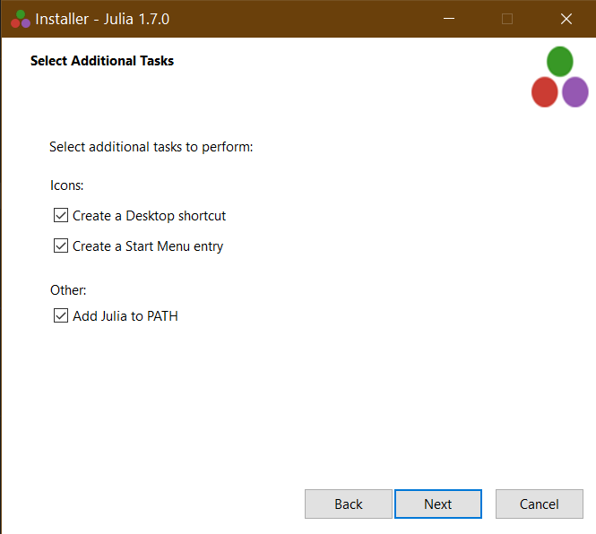

# Getting ready
 In this repo you will find everything you need  to get started with the development subject as an **AII student**
 ## Install Julia (windows user's)
Install Julia in 4 simple steps:

1. Download the Windows Julia installer from https://julialang.org/downloads/.

- Note, the 32-bit Julia binaries work on both 32-bit and 64-bit Windows (x86 and x86_64), but the 64-bit Julia binaries only run on 64-bit Windows (x86_64).
2. Run the installer
3. Check the Add Julia To PATH to automatically add Julia to Environment Variables

4. Now you should have Julia installed in your machine to test it hit `win+R`
5. Type `cmd` and hit **Enter**
6. Type `julia` and hit **Enter**
7. Wait a minute and you should see somthing like this: